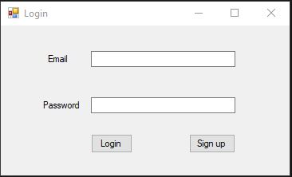
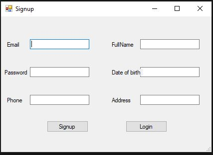
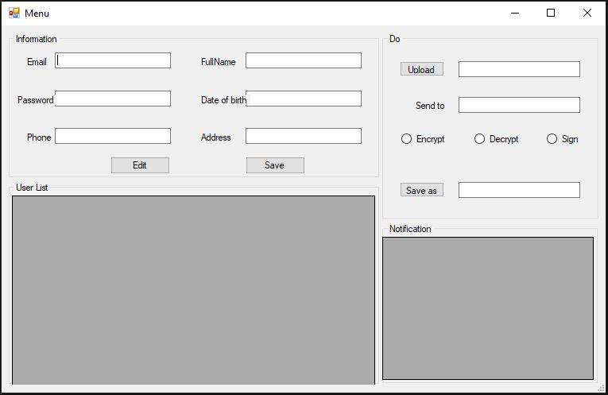

# PROJECT 1 Encryption

## <a id="toc"></a>Table of Contents

I. [Code Structure](#I.)

II. [Usage](#II.)

III. [Developer Contacts](#III.)

<hr>

## I. <a id="I."></a>Code Structure

### <b>Code C#</b>

- <b>GUI</b>

1. <b>Login.cs</b> - User login interface and login interactive functions



2. <b>Signup.cs</b> - User signup interface and signup interactive functions



3. <b>Menu.cs</b> - User menu includes user information, user list, functions, notifications



- <b>Cryptography</b>

1. <b>SHA256.cs</b> - used to hash the user password and hash it before signing

```
    class SHA256
    {
        private static SHA256CryptoServiceProvider CreateProvider();
        public static byte[] Hash(byte[] data);
    }
```

2. <b>RSA.cs</b> - generates a key pair (Public, Private) of length 2048 bits for
RSA algorithm corresponding to each user, Kprivate encrypts the Ksession key

```
public class RSA
    {
        private static RSACryptoServiceProvider rsa = new RSACryptoServiceProvider(2048);
        private byte[] publicKey;
        private byte[] privateKey;
        public String Encrypt(string Plaintext);
        public String Decrypt(string cypherText);
    }
```

3. <b>AES.cs</b> - AES encrypt KPrivate and file that you want to encrypt.

```
public class AES
    {
        private static byte[] iv;
        private static byte[] key;
        public AES(byte[] passphare);

        private static AesCryptoServiceProvider CreateProvider();
        public static byte[] Encrypt(byte[] data);
        public static byte[] Decrypt(byte[] data);
    }
```

- <b>Data</b>

1. <b>DataProvider.cs</b> - Provide the ability to connect to the database (SQL Server)

```
```

2. <b>DTO</b> - Data Transfer Object, so it is used to transfer data between classes and modules of an application.

```
```

3. <b>DAO</b> - Data Access Object, so it encapsulates the logic for retrieving, saving, and updating data in data storage (databases, file systems, whatever).

```
```

### <b>SQL</b>

- <b>project1.sql</b> - create database, create tables, keys and create procedures. Data will be stored according to this structure

[Back to Table of Contents](#toc)

<hr>

## II. <a id="II."></a> Usage


<hr>

## IV. <a id="IV."></a>Developer Contacts

1. Ho Dang Khoa - 19127443 -  - 19127443@student.hcmus.edu.vn

2. Tang Tuong Khang - 19127 -  - @student.hcmus.edu.vn

3. Nguyen Huu Hoang An - 19127 -  - @student.hcmus.edu.vn

[Back to Table of Contents](#toc)

<hr>

